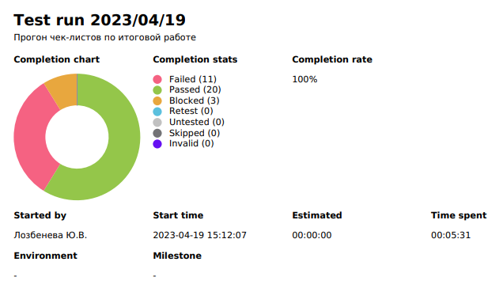

[Ссылка на ТЗ](https://docs.google.com/document/d/1WeNQnA2s80BVtIBF7toAoduFuz_yZc3KykWBb-eFnac/edit)

# Итоговая аттестация. Ручное тестирование
 
## Отчет о тестировании
Стенд https://test-stand.gb.ru/login

### Информация о проекте

Необходимо протестировать функционал – 1.2. Лента своих постов и 1.3. Лента чужих постов

### Задание 1. 

#### Описание процесса тестирования и составление чек-листов
В качестве тестовой документации были составлены чек-листы. Выбор был сделан в пользу них, так как функционал у странички небольшой и нет необходимости в более сложной документации. Чек-листы в данном случае наглядны и удобны при составлении отчета.  
При составлении чек-листов появились вопросы по несоответствию ТЗ и макета (вопросы к составителю ТЗ).
В ТЗ и в макете не согласован язык реализации. В ТЗ продукт в основном на английском, а макет весь на русском. Сам продукт последовательно выполнен на английском, а должен быть на русском!
Также в ТЗ указано, что своих постов должно быть 10, а чужих постов - 4 штуки на одной странице, а на макете мы видим 6 постов и там и там.

### Задание 2. 

#### Тестирование WEB интерфейса
 
1. Тестирование

Необходимо провести тестирование по составленным чек-листам.
В качестве браузера для тестирования WEB-интерфейса был выбран GoogleChrome, версия Версия 111.0.5563.149 (Официальная сборка), (64 бит)

Результат прогона тест-рана Qase.io:

Тестран 

Ссылка на таблицы с чеклистами и баг-репортами в Excel
https://docs.google.com/spreadsheets/d/1Eb18dEP20zMbJN5LAu3B7BGLeEkT8FbQN252BYTlbds/edit?usp=sharing 

 
2. Статистика по дефектам

Из 34 кейсов 20 passed, 11 failed и 3 blocked.
Все 14 баг-репортов – имеют статус Open. 
Большинство failed кейсов на мой взгляд имеют серьезность (Severity) - Normal. Что означает, что продукт хоть и сырой, но рабочий.

 ## Итог тестирования и рекомендации:
Серьезных ошибок в функционале не обнаружено. 
Рекомендуется в рабочем режиме исправить баги из баг-репортов и устранить несоответствия между ТЗ и макетом.
После этого запросить подтверждающее тестирование. 
А также перед выпуском продукта в релиз важно не забыть удалить тестовых пользователей Dummy и их посты.

